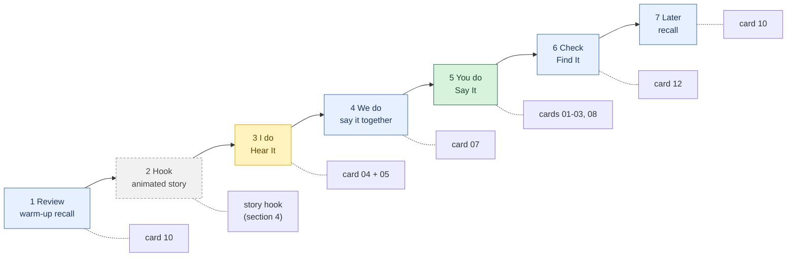
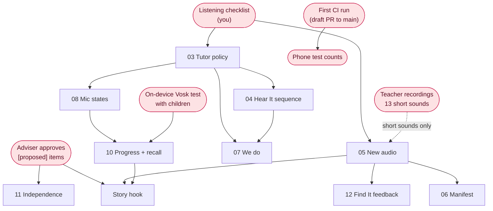
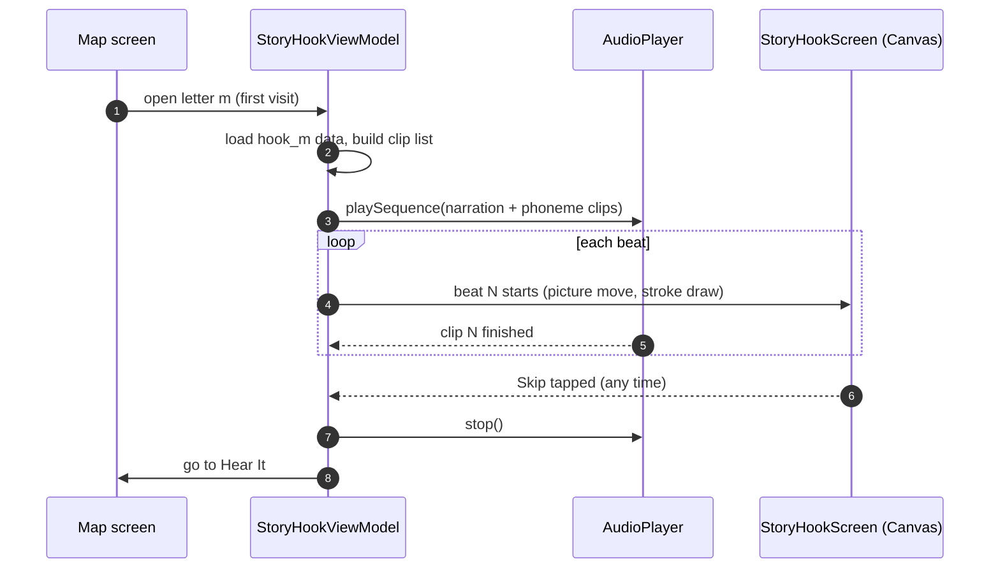

# Proposal: cards after 03–04, and the story hook (FR-NEW-HOOK)

**Status:** proposal for discussion, not a task card. agy does not run anything in this file.
**Date:** 2026-09-29 · **Branch:** `refactor/hear-say-it` · **Spec:** `docs/specs/hear-say-refactor.md`

Contents
1. [Where the cards sit in the lesson](#1-where-the-cards-sit-in-the-lesson)
2. [Proposed cards 05–12](#2-proposed-cards-0512)
3. [What blocks what](#3-what-blocks-what)
4. [The story hook (FR-NEW-HOOK, §5.7)](#4-the-story-hook-fr-new-hook-57)
5. [Storyboard: letter m pilot](#5-storyboard-letter-m-pilot)
6. [How it runs in the app](#6-how-it-runs-in-the-app)
7. [Draft scripts for the other Chapter 1 letters](#7-draft-scripts-for-the-other-chapter-1-letters)
8. [Open questions](#8-open-questions)

---

## 1. Where the cards sit in the lesson

The spec's lesson cycle for one letter (§1.2, Table 1), with the cards that build each step.



| Colour | Meaning |
|---|---|
| Green | Built (cards 00–02, CI pending) |
| Yellow | Ready for agy (cards 03–04) |
| Blue | Proposed card (this file) |
| Grey, dashed | Later, needs approval of a [proposed] item |

---

## 2. Proposed cards 05–12

| Card | Goal | Requirement | Needs first |
|---|---|---|---|
| 05 | **Replace letter-sound and key-word audio.** Copy the approved Kokoro held sounds and key words into the app; remove the stray `tts_[exci…]` clip. Short sounds wait for teacher recordings. | NFR-AUD-01, FR-02 | Listening checklist |
| 06 | **Audio manifest.** JSON manifest in assets: source, gate results, release flag per clip. The build ships only released clips. | NFR-AUD-01 | 05 |
| 07 | **We-do step.** "Say it with me" twice, not scored, between Hear It and the scored Say It. | FR-03 | 03, 04 |
| 08 | **Mic states and live ripple.** Idle, Listening, Processing, Result; ripple follows the voice. A direct `AudioRecord` loop replaces `SpeechService` and measures how long a sound is held. | FR-03, NFR-ASR-01 | 03 |
| 09 | **Remove ng and ñ from the judge.** Delete the legacy path card 01 left in place. | NFR-ASR-01 | — |
| 10 | **Letter progress and recall.** New, Introduced, Needs practice, Secure; warm-up and end-of-session recall with the letter only, no model. | FR-NEW-REC | 08, on-device Vosk test |
| 11 | **Independence.** Ear button on every screen, mascot demo on first use, re-prompt after silence (10 s is [proposed]). | NFR-IND-01 | Decision on 10 s |
| 12 | **Find It feedback.** A wrong tap names that picture's first sound. | FR-03 (Table 1, step 6) | 05 |

**Later, only if the [proposed] items are approved**

| Item | What | Requirement |
|---|---|---|
| Story hook | 10–20 s animated story per letter (section 4) | FR-NEW-HOOK |
| Session length | Close on a success at about 12 minutes | NFR-SES-01 |
| Telemetry | Tutor events for the evidence log | Spec §6.7 |

---

## 3. What blocks what

Boxes with rounded corners are not cards; they are things a person has to do.



---

## 4. The story hook (FR-NEW-HOOK, §5.7)

> **Requirement.** Each letter may open with a 10–20 s animated story featuring its sound and a picture mnemonic that embeds the letter shape, starting with the Chapter 1 letters.
> **Acceptance.** Teacher review in Instrument A, Part 3.
> **Source.** Marungko practice; Ehri et al. (1984).
> **Priority.** P2, **[proposed]**. Not covered by the AGENTS.md Decisions, so it needs approval before any card is marked ready.

**Why it works.** Children learn letter-sound links faster when the letter shape is drawn inside a picture of something that starts with that sound (Ehri, Deffner & Wilce, 1984). Marungko teachers open each letter with a short story for the same reason.

### Who makes what

| Piece | Who | How |
|---|---|---|
| Story script (3–4 lines) | Claude drafts, teachers approve | Section 5 and 7 |
| Narration | You, in the Colab notebook | Kokoro, same as the tutor lines. The held sound is joined in from the phoneme clip, so the voice never says it. |
| Pictures | You, with the existing pipeline | Prompts follow `15_IMAGE_GENERATION_PROMPTS.md`, `16_ILLUSTRATION_STYLE_GUIDE.md`, and the anchor style sheet |
| Animation code | agy, from a card | Compose screen, no new libraries |
| Review | Teachers | Instrument A, Part 3 |

### Two ways to build the pictures

| | Quick version (pilot) | Proper version |
|---|---|---|
| Picture | Existing `images/pictures/picture_mouse.png` | New picture with the letter built into the drawing |
| Letter | Drawn over the picture in code, stroke by stroke | Part of the art; the code only highlights it |
| New art needed | None | One picture per letter |
| Memory aid | Good | Stronger (closer to Ehri et al.) |
| When | First, for letter m | After teachers approve the pilot |

### Screen layers

```
 ┌──────────────────────────────────────────────┐
 │  5  Controls     Skip ▸▸          (ear) ◉    │  ← always on top, 64 dp targets
 │  4  Mascot       Lily reacts (points, hums)  │
 │  3  Letter       stroke path, drawn in code  │  ← the mnemonic
 │  2  Picture      picture_mouse.png           │
 │  1  Background   plain colour (no scene art) │
 └──────────────────────────────────────────────┘
   No on-screen words: Grade 1 children can't read yet.
```

---

## 5. Storyboard: letter m pilot

About 17 s. Lowercase m shown here; the case is an open question (section 8).
The narration never says the letter name ("em"), because letter names are foils in Say It.

```
 FRAME 1  ·  0–4 s                          FRAME 2  ·  4–8 s
 ┌──────────────────────────────┐           ┌──────────────────────────────┐
 │                              │           │                              │
 │      .--.  .--.              │           │      .--.  .--.     ~ mmm ~  │
 │     (    )(    )             │           │     (    )(    )             │
 │      \  (o  o)  /            │           │      \  (-  -)  /    [chz]   │
 │       '-.  ^ .-'   ← enters  │           │       '-.  ^ .-'   ← nibbles │
 │          '--'                │           │          '--'                │
 │  _______________________     │           │  _______________________     │
 └──────────────────────────────┘           └──────────────────────────────┘
  Audio: "This is Mika the mouse."           Audio: "When Mika eats, she hums…"
  Visual: Mika slides in.                     + held /m/ phoneme clip
                                              Visual: eyes close, cheese bobs.

 FRAME 3  ·  8–13 s                         FRAME 4  ·  13–17 s
 ┌──────────────────────────────┐           ┌──────────────────────────────┐
 │                              │           │                              │
 │      ╭──╮  ╭──╮              │           │      ╭──╮  ╭──╮   ✦ glow ✦   │
 │      │  │  │  │   ← strokes  │           │      │  │  │  │              │
 │      │  ╰──╯  │     draw on  │           │      │  ╰──╯  │   ~ mmm ~    │
 │      │        │     the ears │           │      │        │              │
 │                              │           │                              │
 │   zoom 1.0 → 1.4 on the ears │           │   zoom back out, m stays     │
 └──────────────────────────────┘           └──────────────────────────────┘
  Audio: "Look! Her ears make this letter."  Audio: "This letter says…" + /m/
  Visual: the two humps of m trace over      Visual: m pulses, Mika hums again,
  Mika's ears, one stroke at a time.         then hand-off to Hear It.
```

### Timing

```mermaid
gantt
    title Story hook, letter m (about 17 s)
    dateFormat X
    axisFormat %S s

    section Narration
    "This is Mika the mouse."            :n1, 0, 3s
    "When Mika eats, she hums"           :n2, 4, 3s
    /m/ held clip                        :crit, p1, 7, 1s
    "Look! Her ears make this letter."   :n3, 9, 3s
    "This letter says"                   :n4, 13, 2s
    /m/ held clip                        :crit, p2, 15, 1s

    section Picture
    Mika slides in                       :v1, 0, 3s
    Nibble loop                          :v2, 4, 4s
    Zoom on ears                         :v3, 8, 2s
    Zoom back out                        :v4, 13, 2s

    section Letter
    Stroke 1 (left hump)                 :l1, 10, 1s
    Stroke 2 (right hump)                :l2, 11, 1s
    Glow pulse                           :l3, 15, 2s
```



---

## 6. How it runs in the app

The hook reuses the pieces cards 03 and 04 build: tutor clips in `audio/vo/tutor/`, `PAUSE_<ms>` tokens, and `AudioPlayer.playSequence`.



Per-letter data, in the same style as the LessonScript in spec §6.2:

```json
{
  "letter": "m",
  "scene": null,
  "picture": "images/pictures/picture_mouse.png",
  "beats": [
    { "audio": ["hook_m_01"],            "picture": "slide_in",   "ms": 3000 },
    { "audio": ["hook_m_02", "PHONEME"], "picture": "nibble",     "ms": 4000 },
    { "audio": ["hook_m_03"],            "picture": "zoom_ears",  "letter": "draw", "ms": 5000 },
    { "audio": ["car_this_letter_says", "PHONEME"], "picture": "zoom_out", "letter": "glow", "ms": 4000 }
  ],
  "strokes": [
    "M 0.30 0.40 C 0.30 0.20, 0.45 0.20, 0.45 0.40",
    "M 0.45 0.40 C 0.45 0.20, 0.60 0.20, 0.60 0.40"
  ]
}
```

`scene` is null because the app has no scene backgrounds yet (`images/backgrounds/` holds only map props). The pilot uses a plain colour; a scene is new art for the proper version.

Rules the card would carry:
- Plays once on the first visit to a letter; the ear button replays it; Skip is always visible.
- No on-screen text, no emojis, 64 dp touch targets.
- Offline: every clip and picture is a bundled asset.
- Stroke coordinates are fractions of the picture size, so they fit any screen.

---

## 7. Draft scripts for the other Chapter 1 letters

Drafts for teacher review. Each keeps the pattern: meet the character, hear the sound, see the letter in the picture, "This letter says…" + sound.

| Letter | Picture | Where the letter hides | Draft narration |
|---|---|---|---|
| m | mouse | the two humps are Mika's ears | "This is Mika the mouse. When Mika eats, she hums… /m/. Look! Her ears make this letter. This letter says… /m/." |
| s | sun (key word) or snake | snake: its curvy body; sun: a curling ray | "This is Sisa the snake. She hisses… /s/. Look! Her body makes this letter. This letter says… /s/." |
| a | apple | the round body of a is the apple, the stroke is its stem | "Ana finds a big apple. She opens wide… /a/. Look! The apple makes this letter. This letter says… /a/." |
| i | insect | the dot is the insect's head, the stick is its body | "An insect sits very still. It squeaks… /i/. Look! The insect makes this letter. This letter says… /i/." |

Notes:
- s: the app's key word is "sun", but a snake is the classic hissing picture. Teachers choose.
- i: "squeaks /i/" is a placeholder; teachers may prefer a Marungko story they already use.
- Character names (Mika, Sisa, Ana) are placeholders.

---

## 8. Open questions

| # | Question | For |
|---|---|---|
| 1 | Approve FR-NEW-HOOK (a [proposed] P2 item) so a pilot card can be written? | Adviser |
| 2 | Lowercase, uppercase, or both in the picture? | Teachers |
| 3 | Can the story name the letter, or only "this letter" (letter names are foils)? | Teachers |
| 4 | Use the existing Marungko stories teachers already tell, or new ones? | Teachers |
| 5 | Mascot (Lily) in every hook, or a new character per letter? | You |
| 6 | Pilot with the quick version first (existing picture, letter drawn in code)? | You |
| 7 | Where does the hook sit: before Hear It on first visit only, or every time? | You, teachers |
