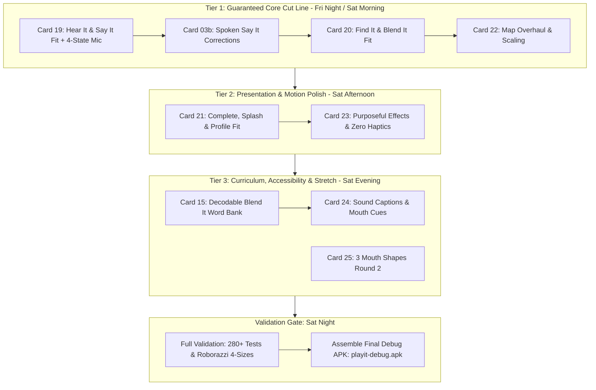

# PlayIT Refactoring Sprint: Master Orchestration Plan (Oct 9–10, 2026)

> **Sprint Goal:** Complete the Hear It / Say It refactoring on branch `refactor/hear-say-it` by **Saturday, October 10, 2026**.  
> **Collaboration Model:**  
> - **Claude (in WSL):** **The Mind & Implementator** — runs `"run and review"`, refines the technical roadmap, writes and implements application code & unit tests, and creates verification runbooks for agy.  
> - **agy (Antigravity):** **The Orchestrator & Validator** — orchestrates the sprint context, validates commits via automated test gates (`./gradlew testDebugUnitTest`), runs Roborazzi screenshot matrices, and verifies APK builds.

---

## 1. Context & Baseline Status (as of Oct 9, 2026, 20:50 PH Time)

- **Active Branch:** `refactor/hear-say-it` (up-to-date with `origin/refactor/hear-say-it`).
- **Test Suite Health:** `./gradlew testDebugUnitTest` is **100% GREEN (BUILD SUCCESSFUL, 36 actionable tasks, 0 failures)**.
- **Recent Commits Ready for Claude Acceptance:**
  1. `b909329`: **Card 13** — 29 batch-1 pictures into app (`images/pictures/`), `picture_up.png` used, `PictureAssetsTest.kt`.
  2. `0886ec4`: **Card 26b** — Removed dead `AudioCompletenessCheck.kt`.
  3. `5489293`: **Card 18** — Adaptive dimensions foundation (`Dimens.kt`, `LessonScaffold.kt`, `Devices.kt`, `LayoutMatrixTest.kt`, `heightIn(min = 64.dp)`).
  4. `1df3f56`: **Card 09b** — Held /s/ sound (`ph_s.wav` from release `2026-10-08-s`), `AudioResolver.kt` updated.
  5. `60c8b2f`: **Card 25** — Mouth-shape Round 1 review (6 of 9 items picked).
  6. `5c3ff64`: Added `MVP Validation Findings & Refactoring Priorities.docx`.
- **Mechanical Checks:** `python3 tools/dev/review_card.py` checks for Cards 13, 26b, 18, and 09b are all **PASS**.

---

## 2. Sprint Roadmap (Oct 9 Night – Oct 10 Night): Staged Execution

Per user decision (2026-10-09), we execute the **Maximum Scope (Cards 19–24, 03b, 15)** via **Staged Execution** to guarantee the mandatory cut line first before expanding into high-value polish and accessibility:

### Staged Prioritization Breakdown:
1. **Tier 1 (Mandatory Core Cut Line):**
   - **Card 19**: Hear It & Say It fit; 4-State Mic (`MicStatus`, `MicButton`, `LessonScaffold`). Fixes MVP Finding #2.
   - **Card 03b**: Spoken Say It corrections (`fb_no_ah`, tutor prompt fragments) in `SayItViewModel.kt`.
   - **Card 20**: Find It & Blend It fit (`LessonScaffold`, responsive card scaling).
   - **Card 22**: Map overhaul (`MapLayout.kt`, responsive rope trail, compact header, 16-char name fit).
   *Milestone Checkpoint: Core gameplay loop 100% responsive and verified across 4 display sizes.*
2. **Tier 2 (High-Value Presentation & Motion Polish):**
   - **Card 21**: Complete, Splash, and Profile screens fit without clipping.
   - **Card 23**: Purposeful effects (tap, correct pop, heart wobble, star drop, center confetti, reduced motion, zero haptics).
3. **Tier 3 (Curriculum, Accessibility & Stretch):**
   - **Card 15**: Purge 5 non-decodable Blend It words in `DatabaseModule.kt` (replace with AM, SUM, TUB, YAM, ZIP; QUIZ exception).
   - **Card 24**: Sound captions and mouth-shape cues (`ArticulationGroup`, `CaptionBubble`, `ArticulationCue`).
   - **Card 25**: Generate remaining 3 mouth shapes (`mouth_wide_open`, `mouth_smile`, `mouth_open_breath`).

---

## 3. Card Execution Specifications for Claude (The Implementator)

Claude implements each card in order, writing the tests and code directly, committing to `refactor/hear-say-it`, and then producing the validator instructions for agy.

### 3.1 Card 19: Hear It & Say It Fit, Plus Mic States (FR-03, NFR-ACC-02)
- **Status:** READY NOW (Card 18 is committed).
- **Plan Reference:** `docs/superpowers/plans/2026-10-06-ui-fit-effects-overhaul.md`, Task 3.
- **Files to Modify/Create:**
  - `presentation/hearit/HearItScreen.kt`: Wrap in `LessonScaffold`; letter card height from `LocalPlayItDimens.current.letterCardHeight`; play button `d.primaryCta`; tag `hearit_play`.
  - `presentation/components/LetterCard.kt`: Responsive constraints (`fillMaxWidth()` + `heightIn(max = d.letterCardHeight)` + `aspectRatio(0.97f)`).
  - `presentation/sayit/MicStatus.kt` [NEW]: Enum (`IDLE`, `LISTENING_SILENT`, `LISTENING_HEARD`, `CORRECT`, `INCORRECT`) and pure mapping `micStatusFor()`.
  - `presentation/sayit/components/MicButton.kt` [NEW]: Dynamic 4-state mic button with animated listening ripple and state transitions.
  - `presentation/sayit/SayItScreen.kt`: Wrap in `LessonScaffold`; mic from `MicButton`; feedback banner in scaffold bottom bar.
  - `presentation/sayit/SayItViewModel.kt`: Expose `micStatus` StateFlow; transition to `LISTENING_HEARD` when first partial speech is detected; reset to `IDLE` when stopped externally.
- **Required Tests:**
  - `MicStatusTest.kt`: `idle`, `listeningSilent`, `listeningHeard`, `correct`, `incorrect`.
  - `SayItViewModelTest.kt`: `partialSpeech_setsHeard`, `recognizerStoppedExternally_returnsToIdle`.
  - `screenshot/LayoutMatrixTest.kt`: `hearIt_playVisible`, `sayIt_micVisible`, `sayIt_micVisible_fontScale13`.
- **Commit Format:**
  `feat(sayit): Hear It and Say It fit every phone; mic shows listening, heard and result (FR-03)`

### 3.2 Card 03b: Spoken Say It Corrections (FR-03)
- **Status:** READY after Card 19.
- **Objective:** Say It feedback plays specific corrective audio lines (`fb_no_ah`, tutor prompt fragments) based on the Vosk error type (`LETTER_NAME`, `ADDED_VOWEL`).
- **Files:** `presentation/sayit/SayItViewModel.kt`, `AudioResolver.kt`, `SayItViewModelTest.kt`.
- **Commit Format:**
  `feat(sayit): spoken corrections for letter names and added vowels (FR-03)`

### 3.3 Card 20: Find It & Blend It Fit (FR-05, FR-13)
- **Status:** READY after Card 19 (supersedes Card 16).
- **Plan Reference:** UI Overhaul Plan, Task 4.
- **Files:** `presentation/findit/FindItScreen.kt`, `presentation/blendit/BlendItScreen.kt`, `presentation/blendit/BlendItCard.kt`, `LayoutMatrixTest.kt`.
- **Objective:** Wrap both screens in `LessonScaffold`; ensure picture cards and CVC word cards scale without clipping at 360x640; verify "Tap to hear word" is not clipped.
- **Commit Format:**
  `feat(ui): Find It and Blend It fit every phone; cards scale cleanly (FR-05, FR-13)`

### 3.4 Card 22: Map Overhaul & Scaling (FR-01)
- **Status:** READY after Card 20.
- **Plan Reference:** UI Overhaul Plan, Task 6.
- **Files:** `presentation/map/MapScreen.kt`, `presentation/map/MapLayout.kt` [NEW], `presentation/map/TopStatsBar.kt`, `TopStatsBarLayoutTest.kt`.
- **Objective:** Procedural rope trail with responsive node spacing; compact top bar where 16-character learner name ellipsizes without pushing stat pills offscreen.
- **Commit Format:**
  `feat(map): responsive trail layout scales to any phone width; compact header (FR-01)`

### 3.5 Card 21: Complete, Splash & Profile Screens Fit (NFR-ACC-02)
- **Plan Reference:** UI Overhaul Plan, Task 5.
- **Files:** `presentation/complete/LetterCompleteScreen.kt`, `presentation/complete/BlendItCompleteScreen.kt`, `presentation/splash/SplashScreen.kt`, `presentation/profile/ProfileSelectScreen.kt`.
- **Commit Format:**
  `feat(ui): complete, splash and profile screens scale across all device profiles (NFR-ACC-02)`

### 3.6 Card 23: Purposeful Effects & Motion (NFR-ACC-02)
- **Plan Reference:** UI Overhaul Plan, Task 7.
- **Files:** `presentation/components/FeedbackEffects.kt` [NEW], `PlayItMotion.kt`, relevant screen composables.
- **Objective:** Confine animations to meaningful moments: tap (100 $\to$ 92 $\to$ 100%), correct pop, gentle heart-loss wobble (no red), star drop, center confetti. Strictly honor `LocalReducedMotion`. No haptics.
- **Commit Format:**
  `feat(effects): purposeful feedback effects; respect reduced motion; zero haptics (NFR-ACC-02)`

### 3.7 Card 24: Sound Captions & Mouth Cues (NFR-ACC-01)
- **Plan Reference:** UI Overhaul Plan, Task 8.
- **Files:** `domain/model/ArticulationGroup.kt` [NEW, pure Kotlin], `domain/manager/CaptionText.kt` [NEW, pure Kotlin], `presentation/components/ArticulationCue.kt` [NEW], `presentation/components/CaptionBubble.kt` [NEW].
- **Objective:** Display 9 mouth-shape cue pictures and synchronized sound captions in *Hear It* and *Say It*, providing accessibility for hearing-impaired learners. Gracefully render nothing if an asset is not yet present.
- **Commit Format:**
  `feat(a11y): visual mouth cues and on-screen sound captions (NFR-ACC-01)`

---

## 4. Claude Instructions: What to do on `"run and review"`

When the user enters `"run and review"`, Claude should execute this unified workflow:

1. **Pull & Inspect State:**
   - Run `git pull origin refactor/hear-say-it`.
   - Read this document (`docs/tasks/SPRINT_OCT10_ORCHESTRATION.md`) and the end of `docs/tasks/SESSION_HANDOFF.md`.
2. **Accept Previous Commits:**
   - Fill in commit hashes and mark `(accepted)` in `docs/evidence-log.md` for Cards `13` (`b909329`), `26b` (`0886ec4`), `18` (`5489293`), and `09b` (`1df3f56`).
3. **Implement Next Card (starting with Card 19):**
   - Read the exact file list and steps from `docs/tasks/card-19-hearit-sayit-fit-mic-states.md` and Task 3 of the UI Overhaul Plan.
   - Implement the code and unit tests.
   - Run tests: `tools/dev/gradlew_wsl.sh testDebugUnitTest`.
   - Commit with the required format (`Card: 19`, `Requirement: FR-03, NFR-ACC-02`, etc.) and push to `origin refactor/hear-say-it`.
4. **Emit Validator Specification for agy:**
   - Update `docs/tasks/VALIDATOR_RUNBOOK_OCT10.md` detailing:
     * Commits ready for agy validation.
     * Automated test commands to run.
     * Specific layout matrix / Roborazzi screenshot checks to perform.
     * Physical APK validation steps.
5. **Cycle Continues:**
   - agy validates the commit and reports results.
   - Claude proceeds to Card 03b $\to$ Card 20 $\to$ Card 22 until the sprint cut line is achieved by Saturday Oct 10.
