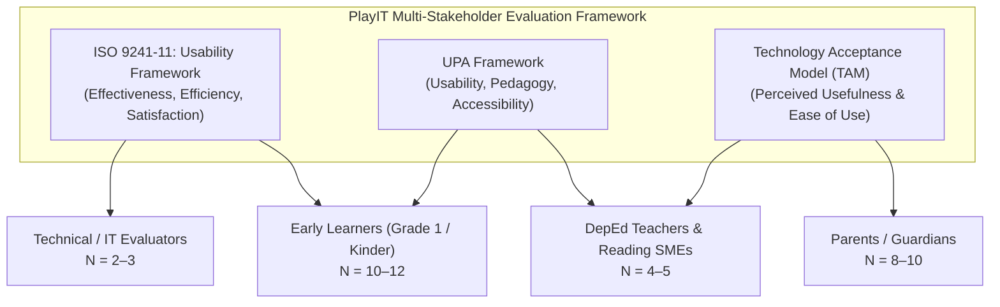
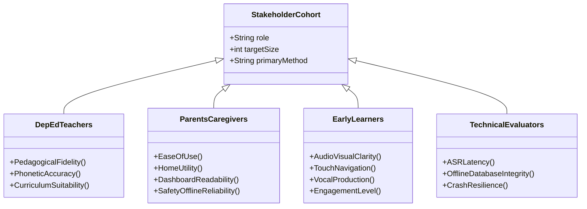

# PlayIT: An Offline-First Gamified Early Literacy Mobile Application Using the DepEd Marungko Approach

## Document: MVP Validation Framework & SMART Evaluation Model
**Course:** IT411 — Capstone & Research 2 | Semester 1, AY 2026–2027  
**Degree Program:** Bachelor of Science in Information Technology  
**Department:** College of Computer Studies, Cebu Institute of Technology – University  
**Target Milestone:** Weeks 1–2 MVP Validation Deliverable  
**Date of Submission:** September 12, 2026  
**Document Version:** 1.0 (Final Architecture & Evaluation Package)

---

## 1. Executive Summary & Research Rationale

Early literacy education in the Philippine public school system faces persistent challenges, including high pupil-to-teacher ratios, inadequate learning materials, and the digital divide characterized by limited or unstable home internet connectivity. While the Department of Education (DepEd) emphasizes the **Marungko Approach**—a phono-syllabic reading technique that introduces letters based on phonemic frequency rather than alphabetical order—many learners lack access to interactive, individualized phonetic practice at home.

**PlayIT** addresses this gap as a 100% offline-first Android mobile application. It pairs the pedagogical structure of the Marungko Approach with modern speech recognition technology (Vosk), engaging gamification, and diagnostic parental telemetry.

The primary objective of the **Weeks 1–2 MVP Validation** is **formative and diagnostic**:
1. To evaluate the usability, accessibility, and cognitive appropriateness of the application for early learners (aged 5–7 years old) and their supervising parents.
2. To obtain expert validation from DepEd Grade 1 reading teachers and Subject Matter Experts (SMEs) regarding the curricular alignment of the phonics progression.
3. To test and refine the data-gathering instruments in preparation for the final summative evaluation in Weeks 8–9.

---

## 2. Theoretical Evaluation Frameworks

In accordance with the IT411 research guidelines, PlayIT integrates a **Tripartite Multi-Dimensional Framework** that evaluates software quality, pedagogical efficacy, and end-user acceptance across distinct stakeholder groups:

### 2.1 Framework 1: ISO 9241-11 Usability Framework
ISO 9241-11 defines usability as the extent to which a product can be used by specified users to achieve specified goals with **Effectiveness**, **Efficiency**, and **Satisfaction** in a specified context of use:
- **Effectiveness:** Assessed via the accuracy with which early learners execute target learning tasks (e.g., successful phoneme vocalization in *Say It*, accurate picture discrimination in *Find It*, and error-free word assembly in *Blend It*).
- **Efficiency:** Assessed by the time required to complete learning nodes, the number of heart deductions incurred, and the number of audio replays requested before correct task completion.
- **Satisfaction:** Measured qualitatively through observable child engagement during gameplay and through a post-activity 3-point visual smiley rating scale.

### 2.2 Framework 2: Usability, Pedagogy, and Accessibility (UPA) Framework
Educational technology intended for young children requires validation beyond generic UI usability. The UPA Framework evaluates:
- **Pedagogy:** Verification that the instructional sequence strictly adheres to the DepEd Marungko phono-syllabic hierarchy; that decodable CVC words are developmentally appropriate for Grade 1 readers; and that positive reinforcement mechanisms encourage mastery without punitive discouragement.
- **Accessibility:** Verification that pediatric physical constraints are satisfied, including large interactive touch targets (minimum 64dp), high-contrast visual elements adhering to WCAG standards, and intuitive non-verbal visual cues that support pre-literate or emerging readers.
- **Usability:** Verification that the interface flow is clear, predictable, and devoid of cognitive friction or accidental navigation traps.

### 2.3 Framework 3: Technology Acceptance Model (TAM)
TAM evaluates how adult stakeholders (parents, guardians, and educators) adopt and perceive the system:
- **Perceived Usefulness (PU):** The degree to which parents and teachers believe PlayIT accelerates English letter-sound mastery and provides actionable diagnostic insights via the Parent Dashboard.
- **Perceived Ease of Use (PEOU):** The degree to which parents believe the application is straightforward to set up, requires minimal technical literacy, and operates reliably in low-resource, 100% offline environments.

---

## 3. Curriculum Scope & 26-Letter Marungko Adaptation

A critical refinement established in the MVP validation design is the **curricular adaptation of the Marungko Sequence for Grade 1 English Phonics**:

### 3.1 Rationale for Excluding `NG` and `Ñ`
1. **Curricular Distinctiveness:** While the Department of Education's *Alpabetong Filipino* comprises 28 letters (including `ñ` and `ng`), English phonics instruction focuses exclusively on the 26 standard letters (A–Z).
2. **Pedagogical Appropriateness:** In English orthography, `ng` is classified as a voiced velar nasal consonant digraph (/ŋ/, as in *ring* or *song*), not an individual alphabetic grapheme. Introducing `ng` as an isolated single letter in early English instruction creates phonological confusion. Furthermore, the grapheme `ñ` is unique to Spanish-derived Filipino orthography and is non-existent in English vocabulary.
3. **Acoustic ASR Reliability:** Offline acoustic speech recognition via Vosk exhibits high recognition stability for English phonemes and whole words, but exhibits high false-rejection rates when evaluating young children attempting to utter isolated non-English graphemes.

### 3.2 Approved 7-Group Sequential Phonics Matrix
The 26 letters are organized into **7 progressive chapters**, preserving the core Marungko frequency-based progression while incorporating milestone *Blend It* word synthesis checkpoints:

| Group / Chapter | Target Letters | Count | Thematic Biome | Canonical Blend It Words (CVC — Fully Seeded & Asset-Verified) |
|:---:|:---:|:---:|---|---|
| **Chapter 1** | `m, s, a, i` | 4 | Guava Greenery | `SAM`, `SIS`, `AIM` *(3 words — Group 1 accepted exception)* |
| **Chapter 2** | `o, b, e, u` | 4 | Mango Orchard | `BUS`, `SUB`, `MOM`, `BEE`, `BIB` |
| **Chapter 3** | `t, k, l, y` | 4 | Chocolate Hills | `BAT`, `MAT`, `KIT`, `TOY`, `BOY` |
| **Chapter 4** | `n, g, p` | **3** | Palm Valley | `PIG`, `PAN`, `BUG`, `PIN`, `NAP` |
| **Chapter 5** | `r, d, h, w` | 4 | Rice Terraces | `DOG`, `HAT`, `HEN`, `BED`, `WEB` |
| **Chapter 6** | `c, f, j` | **3** | Coral Reef | `CAT`, `FAN`, `CAP`, `CUP`, `JAM` |
| **Chapter 7** | `q, v, x, z` | 4 | Mount Pulag Summit | `VAN`, `BOX`, `FOX`, `ZOO`, `QUIZ` |
| **Total** | **26 Letters** | **26** | **7 Biomes** | **33 Decodable CVC Target Words** |

> **Note:** All 33 words are strictly constraint-validated against the cumulative letter availability rule, with full audio pronunciation assets (`word_*.mp3`) and visual illustrations (`blendword_*.png`) verified present in the application package.

---

## 4. SMART Evaluation Objectives & Measurable Metrics

| SMART Dimension | Research Objective | Evaluation Metric | Quantitative / Qualitative Target | Target Respondent Cohort |
|---|---|---|---|---|
| **Specific (S)** | Assess child learning effectiveness across the 3 core sublevels (*Hear It*, *Say It*, *Find It*). | Sublevel task completion rate; First-attempt vocal accuracy on *Say It*; Time-on-task per sublevel. | ≥ 85% task completion without adult intervention; ≥ 75% first-pass speech recognition rate. | Early Learners (Ages 5–7) — **N = 12** |
| **Measurable (M)** | Measure overall system usability and caregiver acceptance using standardized scales. | System Usability Scale (SUS) score; 5-point Likert TAM rating (PU, PEOU, and BI constructs). | Mean SUS score ≥ 75.0 (Grade B+ / "Good"); Mean TAM Perceived Usefulness ≥ 4.2 / 5.0; Mean TAM Behavioral Intention ≥ 4.0 / 5.0. | Parents & Guardians — **N = 10** |
| **Achievable (A)** | Validate pedagogical soundness and curriculum compliance with certified educators. | Expert Review Rubric (7 items, 1–5 scale); Thematic interview coding. | 100% agreement (≥ 4.0 / 5.0) on Marungko fidelity and CVC word age-appropriateness. | DepEd Grade 1 Teachers & Reading Specialists — **N = 5** |
| **Relevant (R)** | Verify complete offline functionality, data privacy, and diagnostic reporting utility. | Local database persistence rate; Offline report generation time; Ambient noise tolerance. | 100% offline persistence (0 data loss); PDF report export time ≤ 3.0 seconds; Noise alert operational at >40dB. | Technical Evaluators — **N = 3** |
| **Time-Bound (T)** | Execute validation trials, synthesize observational data, and update requirements documents. | Deliverable completion dates mapped to IT411 course schedule. | MVP validation protocol finalized by **Sept 12, 2026**; User testing completed by **Sept 18, 2026**; Refactored SRS/SDD submitted by **Sept 19, 2026**. | Capstone Research Team — **Total N = 30** |

---

## 5. Stakeholder Mapping & Instrument Cross-Walk

To ensure each user type evaluates aspects aligned with their expertise and cognitive capacity, the evaluation instruments are role-specific:

### 5.1 Comprehensive Question-to-Construct Mapping

| Item Code | Evaluation Statement / Metric | Theoretical Construct | Intended Respondent Role | Data Type |
|---|---|---|---|---|
| **PED-01** | The letter progression strictly follows the sequential DepEd Marungko Approach. | UPA: Pedagogy | DepEd Teachers / SMEs | 5-pt Likert |
| **PED-02** | The introductory module (*Hear It*) delivers accurate, natural phoneme modeling. | UPA: Pedagogy | DepEd Teachers / SMEs | 5-pt Likert |
| **PED-03** | The speech production module (*Say It*) uses words that are decodable and age-appropriate. | UPA: Pedagogy | DepEd Teachers / SMEs | 5-pt Likert |
| **PED-04** | The picture discrimination module (*Find It*) uses illustrations culturally familiar to Filipino learners. | UPA: Pedagogy | DepEd Teachers / SMEs | 5-pt Likert |
| **PED-05** | The word synthesis module (*Blend It*) respects the cumulative letter availability of each group. | UPA: Pedagogy | DepEd Teachers / SMEs | 5-pt Likert |
| **PED-06** | The 26-letter adaptation (excluding `ng` and `ñ`) is pedagogically appropriate for Grade 1 English. | UPA: Pedagogy | DepEd Teachers / SMEs | 5-pt Likert |
| **PED-07** | The gamification mechanics (hearts, stars, streaks) reinforce learning without cognitive overload. | UPA: Pedagogy | DepEd Teachers / SMEs | 5-pt Likert |
| **TAM-PU01** | PlayIT helps my child learn English letter sounds independently at home. | TAM: Perceived Usefulness | Parents / Guardians | 5-pt Likert |
| **TAM-PU02** | The app makes reading practice more engaging than traditional paper worksheets. | TAM: Perceived Usefulness | Parents / Guardians | 5-pt Likert |
| **TAM-PEOU01**| The app is easy for my child to navigate without constant adult assistance. | TAM: Ease of Use | Parents / Guardians | 5-pt Likert |
| **TAM-PEOU02**| Creating a child profile and selecting an avatar was quick and intuitive. | TAM: Ease of Use | Parents / Guardians | 5-pt Likert |
| **TAM-BI01** | I intend to use or continue using PlayIT with my child regularly for phonics practice at home. | TAM: Behavioral Intention | Parents / Guardians | 5-pt Likert |
| **DASH-01** | The Parent Dashboard clearly identifies which letter sounds need further practice. | TAM: Utility | Parents / Guardians | 5-pt Likert |
| **DASH-02** | The arithmetic security gate (e.g., 7 + 5 = ?) effectively prevents accidental child entry. | ISO: Security | Parents / Guardians | 5-pt Likert |
| **OFFLINE-01** | The 100% offline capability is cost-saving and reliable for our household. | TAM: Practicality | Parents / Guardians | 5-pt Likert |
| **SAFETY-01** | I feel confident because the app contains zero ads, external links, or paid transactions. | ISO: Safety & Privacy | Parents / Guardians | 5-pt Likert |
| **OBS-01** | Child independently taps the unlocked letter node on the Level Map. *(Record time in seconds.)* | ISO: Effectiveness + Efficiency | Early Learners (Observer) | 3-pt Scale + Time (s) |
| **OBS-02** | Child listens to audio model in *Hear It* and mimics the pronunciation. | UPA: Engagement | Early Learners (Observer) | 3-pt Scale |
| **OBS-03** | Child taps the microphone and speaks clearly into the device. *(Record time from mic tap to ASR result in seconds.)* | ISO: Usability / ASR Efficiency | Early Learners (Observer) | 3-pt Scale + Time (s) |
| **OBS-04** | Child correctly discriminates target pictures from distractors in *Find It*. | ISO: Effectiveness | Early Learners (Observer) | 3-pt Scale |
| **OBS-05** | Child drags/taps letter tiles to build the target CVC word in *Blend It*. *(Record time from word display to submission in seconds.)* | UPA: Cognitive Load + Efficiency | Early Learners (Observer) | 3-pt Scale + Time (s) |
| **SMILEY-01** | Child's post-session affective reaction ("How did you feel playing with Lily?"). | ISO: Satisfaction | Early Learners | 3-pt Visual Scale |
| **SYS-01** | Speech recognition latency from mic release to feedback display (≤ 0.5s). | ISO 25010: Performance | Technical Evaluators | Numeric (ms) |
| **SYS-02** | App operational stability and crash resilience during rapid UI navigation. | ISO 25010: Reliability | Technical Evaluators | Binary Pass/Fail |
| **SYS-03** | Local SQLite/Room database persistence verified across application restarts. | ISO 25010: Integrity | Technical Evaluators | Binary Pass/Fail |

---

## 6. Testing Protocol & Administration Guidelines

1. **Pre-Evaluation Setup:** Test devices (Android 8.0+ tablets and phones) are pre-loaded with `playit-debug.apk`. The ambient noise level of the test environment is verified to be ≤ 40dB using the built-in noise indicator.
2. **Informed Consent & Demographic Profiling:** Parents and teachers receive a brief orientation outlining the study's objective. Written/digital consent is recorded.
3. **Observational Gameplay Session (15–20 minutes):**
   - The child is guided to create a profile or select an existing avatar.
   - The child completes one full Letter Node (*Hear It → Say It → Find It*) and one milestone *Blend It* word challenge.
   - The researcher/parent completes the observational rubric (**OBS-01 to OBS-05**) without prompting the child unless the child is blocked for > 30 seconds.
4. **Child Visual Feedback:** The child is presented with the 3-point visual smiley scale (**SMILEY-01**) to record immediate affective response.
5. **Parent & Teacher Questionnaires:** Parents complete the TAM/Usability instrument; teachers complete the Pedagogical Quality rubric and qualitative interview.
6. **Data Aggregation & Analysis:** Responses are captured via the connected Google Form, stored in the synchronized Google Sheet, and analyzed for descriptive statistics (means, standard deviations, task success percentages) and thematic qualitative categories.
