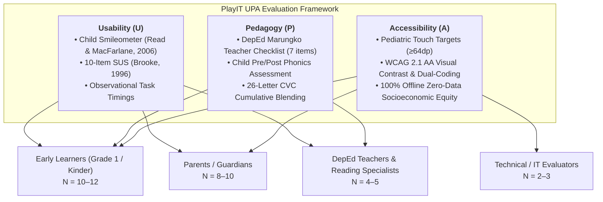
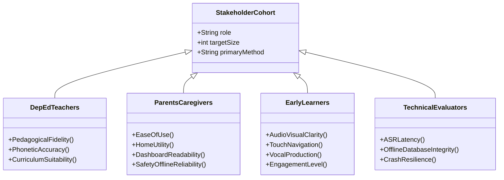

# PlayIT: An Offline-First Gamified Early Literacy Mobile Application Using the DepEd Marungko Approach

## Document: MVP Validation Framework & SMART Evaluation Model
**Course:** IT411 — Capstone & Research 2 | Semester 1, AY 2026–2027  
**Degree Program:** Bachelor of Science in Information Technology  
**Department:** College of Computer Studies, Cebu Institute of Technology – University  
**Target Milestone:** Weeks 1–2 MVP Validation Deliverable  
**Date of Submission:** September 12, 2026  
**Document Version:** 1.0 (Final Architecture & Evaluation Package)

---

## 1. Executive Summary & Research Rationale

Early literacy education in the Philippine public school system faces persistent challenges, including high pupil-to-teacher ratios, inadequate learning materials, and the digital divide characterized by limited or unstable home internet connectivity. While the Department of Education (DepEd) emphasizes the **Marungko Approach**—a phono-syllabic reading technique that introduces letters based on phonemic frequency rather than alphabetical order—many learners lack access to interactive, individualized phonetic practice at home.

**PlayIT** addresses this gap as a 100% offline-first Android mobile application. It pairs the pedagogical structure of the Marungko Approach with modern speech recognition technology (Vosk), engaging gamification, and diagnostic parental telemetry.

The primary objective of the **Weeks 1–2 MVP Validation** is **formative and diagnostic**:
1. To evaluate the usability, accessibility, and cognitive appropriateness of the application for early learners (aged 5–7 years old) and their supervising parents.
2. To obtain expert validation from DepEd Grade 1 reading teachers and Subject Matter Experts (SMEs) regarding the curricular alignment of the phonics progression.
3. To test and refine the data-gathering instruments in preparation for the final summative evaluation in Weeks 8–9.

---

## 2. Theoretical Evaluation Framework: The UPA Model

In educational technology for early childhood learners, generic software usability metrics alone are insufficient. PlayIT adopts the **UPA Framework (Usability, Pedagogy, Accessibility)** as its primary overarching evaluation architecture. Each UPA component is operationalized through validated instruments across distinct stakeholder cohorts:

### 2.1 Component 1: Usability (U)
- **Child Usability (Smileometer):** Young children (ages 5–7) cannot reliably complete multi-point textual Likert scales. Affective satisfaction is assessed using the **Smileometer** (Read & MacFarlane, 2006)—a 3-point visual scale (Sad, Neutral, Happy) presented immediately post-session.
- **Adult Usability (System Usability Scale - SUS):** Parents and educators complete the standardized **10-item System Usability Scale (SUS)** (Brooke, 1996), producing a composite usability score benchmarked against the industry standard (Target: Mean SUS ≥ 75.0 / Grade B+).
- **Behavioral Task Efficiency:** Evaluated through direct observation of time-on-task, touch accuracy, and vocal speech recognition latency (≤ 500ms).

### 2.2 Component 2: Pedagogy (P)
- **Expert Curricular Compliance:** Certified DepEd Grade 1 teachers and reading specialists evaluate the curriculum using a 7-item checklist (`PED-01` to `PED-07`) validating Marungko sequence fidelity, phoneme modeling clarity, decodable CVC appropriateness, and the 26-letter English scope.
- **Empirical Learning Gain (Pre/Post Test):** To provide quantitative evidence of learning efficacy for Capstone Chapter 4, a 10-item diagnostic phonics assessment is administered before gameplay (Pre-Test) and after gameplay (Post-Test) to evaluate letter-sound recognition and CVC blending score gains.

### 2.3 Component 3: Accessibility (A)
- **Pediatric Ergonomics:** Evaluates physical UI accessibility for young learners, verifying large interactive touch targets (minimum 64dp) and high-contrast color palettes adhering to WCAG 2.1 AA standards.
- **Cognitive & Non-Verbal Scaffolding:** Uses mascot speech bubbles, spoken audio models, and visual icon dual-coding so emerging or non-reading children can navigate without adult intervention.
- **Socioeconomic & Offline Equity:** Verifies 100% offline operability with zero mobile data requirement, ensuring equitable access for low-resource households with zero advertisements, paywalls, or privacy risks.

---

## 3. Curriculum Scope & 26-Letter Marungko Adaptation

A critical refinement established in the MVP validation design is the **curricular adaptation of the Marungko Sequence for Grade 1 English Phonics**:

### 3.1 Rationale for Excluding `NG` and `Ñ`
1. **Curricular Distinctiveness:** While the Department of Education's *Alpabetong Filipino* comprises 28 letters (including `ñ` and `ng`), English phonics instruction focuses exclusively on the 26 standard letters (A–Z).
2. **Pedagogical Appropriateness:** In English orthography, `ng` is classified as a voiced velar nasal consonant digraph (/ŋ/, as in *ring* or *song*), not an individual alphabetic grapheme. Introducing `ng` as an isolated single letter in early English instruction creates phonological confusion. Furthermore, the grapheme `ñ` is unique to Spanish-derived Filipino orthography and is non-existent in English vocabulary.
3. **Acoustic ASR Reliability:** Offline acoustic speech recognition via Vosk exhibits high recognition stability for English phonemes and whole words, but exhibits high false-rejection rates when evaluating young children attempting to utter isolated non-English graphemes.

### 3.2 Approved 7-Group Sequential Phonics Matrix
The 26 letters are organized into **7 progressive chapters**, preserving the core Marungko frequency-based progression while incorporating milestone *Blend It* word synthesis checkpoints:

| Group / Chapter | Target Letters | Count | Thematic Biome | Canonical Blend It Words (CVC — Fully Seeded & Asset-Verified) |
|:---:|:---:|:---:|---|---|
| **Chapter 1** | `m, s, a, i` | 4 | Guava Greenery | `SAM`, `SIS`, `AIM` *(3 words — Group 1 accepted exception)* |
| **Chapter 2** | `o, b, e, u` | 4 | Mango Orchard | `BUS`, `SUB`, `MOM`, `BEE`, `BIB` |
| **Chapter 3** | `t, k, l, y` | 4 | Chocolate Hills | `BAT`, `MAT`, `KIT`, `TOY`, `BOY` |
| **Chapter 4** | `n, g, p` | **3** | Palm Valley | `PIG`, `PAN`, `BUG`, `PIN`, `NAP` |
| **Chapter 5** | `r, d, h, w` | 4 | Rice Terraces | `DOG`, `HAT`, `HEN`, `BED`, `WEB` |
| **Chapter 6** | `c, f, j` | **3** | Coral Reef | `CAT`, `FAN`, `CAP`, `CUP`, `JAM` |
| **Chapter 7** | `q, v, x, z` | 4 | Mount Pulag Summit | `VAN`, `BOX`, `FOX`, `ZOO`, `QUIZ` |
| **Total** | **26 Letters** | **26** | **7 Biomes** | **33 Decodable CVC Target Words** |

> **Note:** All 33 words are strictly constraint-validated against the cumulative letter availability rule, with full audio pronunciation assets (`word_*.mp3`) and visual illustrations (`blendword_*.png`) verified present in the application package.

---

## 4. SMART Evaluation Objectives & Measurable Metrics

| SMART Dimension | Research Objective | Evaluation Metric | Quantitative / Qualitative Target | Target Respondent Cohort |
|---|---|---|---|---|
| **Specific (S)** | Assess child learning effectiveness across the 3 core sublevels (*Hear It*, *Say It*, *Find It*). | Sublevel task completion rate; First-attempt vocal accuracy on *Say It*; Time-on-task per sublevel. | ≥ 85% task completion without adult intervention; ≥ 75% first-pass speech recognition rate. | Early Learners (Ages 5–7) — **N = 12** |
| **Measurable (M)** | Measure overall system usability and caregiver acceptance using standardized scales. | System Usability Scale (SUS) score; 5-point Likert TAM rating (PU, PEOU, and BI constructs). | Mean SUS score ≥ 75.0 (Grade B+ / "Good"); Mean TAM Perceived Usefulness ≥ 4.2 / 5.0; Mean TAM Behavioral Intention ≥ 4.0 / 5.0. | Parents & Guardians — **N = 10** |
| **Achievable (A)** | Validate pedagogical soundness and curriculum compliance with certified educators. | Expert Review Rubric (7 items, 1–5 scale); Thematic interview coding. | 100% agreement (≥ 4.0 / 5.0) on Marungko fidelity and CVC word age-appropriateness. | DepEd Grade 1 Teachers & Reading Specialists — **N = 5** |
| **Relevant (R)** | Verify complete offline functionality, data privacy, and diagnostic reporting utility. | Local database persistence rate; Offline report generation time; Ambient noise tolerance. | 100% offline persistence (0 data loss); PDF report export time ≤ 3.0 seconds; Noise alert operational at >40dB. | Technical Evaluators — **N = 3** |
| **Time-Bound (T)** | Execute validation trials, synthesize observational data, and update requirements documents. | Deliverable completion dates mapped to IT411 course schedule. | MVP validation protocol finalized by **Sept 12, 2026**; User testing completed by **Sept 18, 2026**; Refactored SRS/SDD submitted by **Sept 19, 2026**. | Capstone Research Team — **Total N = 30** |

---

## 5. Stakeholder Mapping & Instrument Cross-Walk

To ensure each user type evaluates aspects aligned with their expertise and cognitive capacity, the evaluation instruments are role-specific:

### 5.1 Comprehensive Question-to-Construct Mapping (UPA Model)

| Item Code | Evaluation Statement / Metric | UPA Theoretical Construct | Target Respondent | Instrument / Data Type |
|---|---|---|---|---|
| **PED-01** | The letter progression strictly follows the sequential DepEd Marungko Approach. | Pedagogy: Sequence Fidelity | DepEd Teachers / SMEs | 5-pt Likert (1–5) |
| **PED-02** | The introductory module (*Hear It*) delivers accurate, natural phoneme modeling. | Pedagogy: Phonemic Audio | DepEd Teachers / SMEs | 5-pt Likert (1–5) |
| **PED-03** | The speech production module (*Say It*) uses words that are decodable and age-appropriate. | Pedagogy: Vocalization | DepEd Teachers / SMEs | 5-pt Likert (1–5) |
| **PED-04** | The picture discrimination module (*Find It*) uses illustrations culturally familiar to Filipino learners. | Pedagogy: Visual Discrimination | DepEd Teachers / SMEs | 5-pt Likert (1–5) |
| **PED-05** | The word synthesis module (*Blend It*) respects the cumulative letter availability of each group. | Pedagogy: CVC Blending | DepEd Teachers / SMEs | 5-pt Likert (1–5) |
| **PED-06** | The 26-letter adaptation (excluding `ng` and `ñ`) is pedagogically appropriate for Grade 1 English. | Pedagogy: Scope Validity | DepEd Teachers / SMEs | 5-pt Likert (1–5) |
| **PED-07** | The gamification mechanics (hearts, stars, streaks) reinforce learning without cognitive overload. | Pedagogy: Motivation | DepEd Teachers / SMEs | 5-pt Likert (1–5) |
| **PRE-POST** | Pre-play vs. post-play diagnostic test measuring phoneme identification and CVC blending accuracy. | Pedagogy: Empirical Learning Gain | Early Learners (Tested) | 0–10 Score Delta (Pre vs. Post) |
| **SUS-01** | I think that I would like to use PlayIT frequently for my child's/students' reading practice. | Usability: System Usability Scale | Parents & Teachers | 5-pt Likert (Standard SUS) |
| **SUS-02** | I found the application unnecessarily complex. *(Reverse-Scored)* | Usability: System Usability Scale | Parents & Teachers | 5-pt Likert (Standard SUS) |
| **SUS-03** | I thought the application was easy to use and navigate. | Usability: System Usability Scale | Parents & Teachers | 5-pt Likert (Standard SUS) |
| **SUS-04** | I think that I would need the support of a technical person to use this app. *(Reverse-Scored)* | Usability: System Usability Scale | Parents & Teachers | 5-pt Likert (Standard SUS) |
| **SUS-05** | I found the various functions in this system were well integrated. | Usability: System Usability Scale | Parents & Teachers | 5-pt Likert (Standard SUS) |
| **SUS-06** | I thought there was too much inconsistency in this system. *(Reverse-Scored)* | Usability: System Usability Scale | Parents & Teachers | 5-pt Likert (Standard SUS) |
| **SUS-07** | I would imagine that most people would learn to use this system very quickly. | Usability: System Usability Scale | Parents & Teachers | 5-pt Likert (Standard SUS) |
| **SUS-08** | I found the system very cumbersome or confusing to use. *(Reverse-Scored)* | Usability: System Usability Scale | Parents & Teachers | 5-pt Likert (Standard SUS) |
| **SUS-09** | I felt very confident using the application. | Usability: System Usability Scale | Parents & Teachers | 5-pt Likert (Standard SUS) |
| **SUS-10** | I needed to learn a lot of things before I could get going with this system. *(Reverse-Scored)* | Usability: System Usability Scale | Parents & Teachers | 5-pt Likert (Standard SUS) |
| **SMILEY-01** | Child's post-session affective reaction ("How did you feel playing with Lily?"). | Usability: Affective Satisfaction | Early Learners | 3-pt Visual Smileometer |
| **OBS-01** | Child independently taps the unlocked letter node on the Level Map. *(Record time in seconds.)* | Usability: Efficiency | Early Learners (Observed) | 3-pt Rubric + Time (s) |
| **OBS-02** | Child listens to audio model in *Hear It* and mimics the pronunciation. | Usability: Engagement | Early Learners (Observed) | 3-pt Rubric |
| **OBS-03** | Child taps the microphone and speaks clearly into the device. *(Record time to ASR result.)* | Usability: Vocal Efficiency | Early Learners (Observed) | 3-pt Rubric + Time (s) |
| **OBS-04** | Child correctly discriminates target pictures from distractors in *Find It*. | Usability: Effectiveness | Early Learners (Observed) | 3-pt Rubric |
| **OBS-05** | Child drags/taps letter tiles to build the target CVC word in *Blend It*. *(Record time to submit.)* | Usability: Cognitive Load | Early Learners (Observed) | 3-pt Rubric + Time (s) |
| **ACC-01** | Interactive touch targets (≥64dp) are large and comfortable for small child hands. | Accessibility: Ergonomics | Parents & Teachers | 5-pt Likert (1–5) |
| **ACC-02** | Spoken audio models and visual icons allow pre-readers to navigate without reading text. | Accessibility: Dual-Coding | Parents & Teachers | 5-pt Likert (1–5) |
| **ACC-03** | 100% offline operability (zero WiFi/data) provides equal access for low-resource homes. | Accessibility: Socioeconomic Equity | Parents & Teachers | 5-pt Likert (1–5) |
| **ACC-04** | Zero advertisements, zero paid transactions, and offline storage protect child privacy. | Accessibility: Safety & Privacy | Parents & Teachers | 5-pt Likert (1–5) |
| **SYS-01** | Speech recognition latency from mic release to feedback display (≤ 0.5s). | Technical: ISO 25010 Latency | Technical Evaluators | Numeric (ms) |
| **SYS-02** | App operational stability and 60 FPS animation smoothness during rapid navigation. | Technical: ISO 25010 Reliability | Technical Evaluators | Binary Pass/Fail |
| **SYS-03** | Local SQLite/Room database persistence verified across application force-close restarts. | Technical: ISO 25010 Integrity | Technical Evaluators | Binary Pass/Fail |

---

## 6. Testing Protocol & Administration Guidelines

1. **Pre-Evaluation Setup:** Test devices (Android 8.0+ tablets and phones) are pre-loaded with `playit-debug.apk`. The ambient noise level of the test environment is verified to be ≤ 40dB using the built-in noise indicator.
2. **Informed Consent & Demographic Profiling:** Parents and teachers receive a brief orientation outlining the study's objective. Written/digital consent is recorded.
3. **Observational Gameplay Session (15–20 minutes):**
   - The child is guided to create a profile or select an existing avatar.
   - The child completes one full Letter Node (*Hear It → Say It → Find It*) and one milestone *Blend It* word challenge.
   - The researcher/parent completes the observational rubric (**OBS-01 to OBS-05**) without prompting the child unless the child is blocked for > 30 seconds.
4. **Child Visual Feedback:** The child is presented with the 3-point visual smiley scale (**SMILEY-01**) to record immediate affective response.
5. **Parent & Teacher Questionnaires:** Parents complete the TAM/Usability instrument; teachers complete the Pedagogical Quality rubric and qualitative interview.
6. **Data Aggregation & Analysis:** Responses are captured via the connected Google Form, stored in the synchronized Google Sheet, and analyzed for descriptive statistics (means, standard deviations, task success percentages) and thematic qualitative categories.
