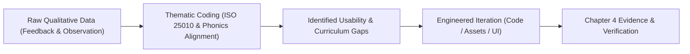

# PlayIT — MVP Validation Instrument Package (Weeks 1–2 Deliverables)
**Course:** IT411 Capstone Project | Semester 1, AY 2026–2027  
**Project Title:** PlayIT: An Offline-First Gamified Early Literacy Mobile Application Using the DepEd Marungko Approach  
**Theoretical Frameworks:** ISO/IEC 25010 Software Quality Model, Technology Acceptance Model (TAM), and DepEd Phono-Syllabic Phonics Framework.

---

## Table of Contents
1. [Overview and Validation Protocol](#1-overview-and-validation-protocol)
2. [Instrument 1: Subject Matter Expert (SME) & DepEd Teacher Evaluation Form](#2-instrument-1-subject-matter-expert-sme--deped-teacher-evaluation-form)
3. [Instrument 2: Parent & Guardian Usability & Acceptance Questionnaire](#3-instrument-2-parent--guardian-usability--acceptance-questionnaire)
4. [Instrument 3: Child Observational Usability Rubric & Visual Rating](#4-instrument-3-child-observational-usability-rubric--visual-rating)
5. [Instrument 4: Semi-Structured Qualitative Interview Guide](#5-instrument-4-semi-structured-qualitative-interview-guide)
6. [Data Coding & Analysis Matrix for Thesis Chapter 4](#6-data-coding--analysis-matrix-for-thesis-chapter-4)

---

## 1. Overview and Validation Protocol

### 1.1 Purpose of Weeks 1–2 MVP Validation
The primary objective of this initial validation is **not statistical proof**, but **formative diagnostic evaluation**:
- Identify usability barriers, cognitive friction, and software bugs before final development lock.
- Verify the pedagogical appropriateness of the 28-letter Marungko progression and the 33 CVC Blend It words.
- Assess parent and teacher acceptance of the offline-first dashboard and voice-interactive mechanics.
- Refine the evaluation instruments for the final summative evaluation later in the semester.

### 1.2 Target Evaluation Cohort Matrix (N = 25–30)

| Stakeholder Group | Target Size | Evaluation Method | Key Measurement Objective |
|---|:---:|---|---|
| **Early Learners (Ages 3–7 / Grade 1)** | 10–12 | Task Observation & 3-Point Visual Scale | Engagement, audio-visual clarity, microphone usability. |
| **Parents / Primary Guardians** | 8–10 | 5-Point Likert Questionnaire + Interview | Ease of use, dashboard clarity, safety, offline reliability. |
| **SMEs / DepEd Reading Teachers** | 4–5 | Pedagogical Quality Checklist & Expert Review | Marungko sequence fidelity, phonics accuracy, CVC suitability. |
| **Technical / IT Evaluators** | 2–3 | ISO/IEC 25010 Quality Rubric | Offline performance, ASR latency, crash resilience. |

---

## 2. Instrument 1: Subject Matter Expert (SME) & DepEd Teacher Evaluation Form

**Target Respondents:** Grade 1 Teachers, Kindergarten Educators, Reading Specialists, Speech-Language Pathologists.  
**Scoring Scale:** 5 = Strongly Agree, 4 = Agree, 3 = Neutral, 2 = Disagree, 1 = Strongly Disagree.

### Part A: Evaluator Profile
- **Name (Optional):** ____________________________________
- **Designation / Role:** [ ] Kindergarten Teacher [ ] Grade 1 Teacher [ ] Reading Specialist [ ] Other: __________
- **Years of Teaching Experience:** [ ] 1–3 yrs [ ] 4–7 yrs [ ] 8–15 yrs [ ] 15+ yrs
- **Institution / School:** ____________________________________

---

### Part B: Pedagogical and Instructional Quality Evaluation

| Item Code | Evaluation Criterion | 1 | 2 | 3 | 4 | 5 | Remarks / Specific Notes |
|---|---|:---:|:---:|:---:|:---:|:---:|---|
| **PED-01** | The letter progression strictly follows the 7-group sequential DepEd Marungko Approach. | [ ] | [ ] | [ ] | [ ] | [ ] | |
| **PED-02** | The introductory module (*Hear It*) provides accurate, natural, and clear phoneme sound modeling. | [ ] | [ ] | [ ] | [ ] | [ ] | |
| **PED-03** | The voice recognition module (*Say It*) effectively encourages vocal production without discouraging the child. | [ ] | [ ] | [ ] | [ ] | [ ] | |
| **PED-04** | The picture discrimination module (*Find It*) uses illustrations that are unambiguous and easily recognizable by Filipino children. | [ ] | [ ] | [ ] | [ ] | [ ] | |
| **PED-05** | The word synthesis module (*Blend It*) uses concrete, age-appropriate, decodable CVC words (e.g., *MOM, BEE, BUG, DOG, BED*). | [ ] | [ ] | [ ] | [ ] | [ ] | |
| **PED-06** | The 33 Blend It words strictly respect the cumulative letter availability constraints of each Marungko group. | [ ] | [ ] | [ ] | [ ] | [ ] | |
| **PED-07** | The gamification mechanics (hearts, stars, milestone unlocks) support positive reinforcement without causing cognitive overload. | [ ] | [ ] | [ ] | [ ] | [ ] | |
| **PED-08** | The handling of Filipino digraphs (`NG`) and regional graphemes (`Ñ`) is pedagogically sound for an English phonics curriculum. | [ ] | [ ] | [ ] | [ ] | [ ] | |

---

### Part C: Qualitative SME Feedback
1. **Curriculum Alignment:** Are there specific words or illustrations in the 7 groups that you recommend modifying for Grade 1 Filipino learners?  
   *Response:* __________________________________________________________________________________________
2. **Pacing and Progression:** Is the gating mechanism (mastering 4 letters before unlocking the Blend It checkpoint) appropriate for early readers?  
   *Response:* __________________________________________________________________________________________
3. **Suggestions for Enhancement:** What additional features would help teachers or reading remediation coordinators?  
   *Response:* __________________________________________________________________________________________

---

## 3. Instrument 2: Parent & Guardian Usability & Acceptance Questionnaire

**Target Respondents:** Parents or primary caregivers of children aged 3 to 7 years old.  
**Scoring Scale:** 5 = Strongly Agree, 4 = Agree, 3 = Neutral, 2 = Disagree, 1 = Strongly Disagree.

### Part A: Respondent & Child Profile
- **Parent / Guardian Name (Optional):** ____________________________________
- **Child's Age:** [ ] 3–4 yrs [ ] 5 yrs (Kindergarten) [ ] 6–7 yrs (Grade 1)
- **Device Used for Testing:** [ ] Android Phone [ ] Android Tablet
- **Home Internet Connectivity:** [ ] Always connected [ ] Mobile data / intermittent [ ] No home internet

---

### Part B: Technology Acceptance & System Usability

| Item Code | Evaluation Criterion | 1 | 2 | 3 | 4 | 5 | Observations |
|---|---|:---:|:---:|:---:|:---:|:---:|---|
| **TAM-PU01** | PlayIT helps my child learn and practice English letter sounds independently at home. | [ ] | [ ] | [ ] | [ ] | [ ] | |
| **TAM-PU02** | The app makes learning to read more enjoyable and engaging for my child compared to traditional worksheets. | [ ] | [ ] | [ ] | [ ] | [ ] | |
| **TAM-PEOU01** | The application is easy for my child to navigate without constant adult assistance. | [ ] | [ ] | [ ] | [ ] | [ ] | |
| **TAM-PEOU02** | Creating a profile and selecting an avatar was straightforward and intuitive. | [ ] | [ ] | [ ] | [ ] | [ ] | |
| **DASH-01** | The Parent Dashboard clearly shows which letter sounds my child has mastered and which need more practice. | [ ] | [ ] | [ ] | [ ] | [ ] | |
| **DASH-02** | The arithmetic security gate (`e.g., 7 + 5 = ?`) effectively prevents my child from accidentally entering parent settings. | [ ] | [ ] | [ ] | [ ] | [ ] | |
| **OFFLINE-01** | The 100% offline capability (no internet required after download) is beneficial and cost-saving for our household. | [ ] | [ ] | [ ] | [ ] | [ ] | |
| **SAFETY-01** | I feel confident allowing my child to use PlayIT because it is free of advertisements, external links, and in-app purchases. | [ ] | [ ] | [ ] | [ ] | [ ] | |

---

### Part C: Open-Ended Parent Feedback
1. What part of the application did your child enjoy the most?  
   *Response:* __________________________________________________________________________________________
2. Did your child encounter any confusion or difficulty while tapping buttons or speaking into the microphone?  
   *Response:* __________________________________________________________________________________________
3. What features or improvements would you like to see in the final version?  
   *Response:* __________________________________________________________________________________________

---

## 4. Instrument 3: Child Observational Usability Rubric & Visual Rating

**Target Respondents:** Children aged 3 to 7 years old (Administered via adult observation).  
**Protocol:** The researcher/parent observes the child completing 1 Letter Node (*Hear It → Say It → Find It*) and 1 *Blend It* word activity.

### Part A: Task Completion & Behavioral Observation Rubric

| Task / Observation Metric | Success Level | Observer Notes & Time Taken |
|---|---|---|
| **Task 1: Profile Selection & Map Entry** <br>Child selects profile avatar and taps the active letter node. | [ ] Independent Success <br>[ ] Needed 1 Prompt <br>[ ] Needed Adult Assistance | |
| **Task 2: Hear It Audio Engagement** <br>Child listens to the phoneme pronunciation and taps the replay button. | [ ] High Engagement (Repeated sound) <br>[ ] Neutral <br>[ ] Ignored / Skipped | |
| **Task 3: Say It Microphone Production** <br>Child taps the mic button and speaks the letter sound clearly. | [ ] First Attempt Pass <br>[ ] Second Attempt Pass <br>[ ] Struggled with Mic / Vosk ASR | |
| **Task 4: Find It Picture Discrimination** <br>Child identifies and taps the 3 target images from the 5-card grid. | [ ] 3/3 Correct on First Try <br>[ ] 1–2 Mistakes (Lost Heart) <br>[ ] Needed Adult Clarification | |
| **Task 5: Blend It Tile Arrangement** <br>Child drags/taps letter tiles to build the target CVC word (e.g., *M-O-M*). | [ ] Smooth Tile Placement <br>[ ] Minor Tap Retries <br>[ ] Needed Hint / Got Confused | |

---

### Part B: Child Visual Rating Scale (Post-Session 3-Point Smiley Scale)
*The observer shows the child the three visual cards below and asks: "How did you feel playing with Lily today?"*

```
     [  1  ]                 [  2  ]                 [  3  ]
   (  T_T  )               (  o_o  )               (  ^o^  )
     SAD                    NEUTRAL                  HAPPY
  "Difficult"             "It's Okay"              "Fun & Easy"
```

- **Child's Selected Rating:** [ ] 1 - Sad / Frustrated  [ ] 2 - Neutral / Okay  [ ] 3 - Happy / Loved it
- **Child's Spontaneous Quotes / Reactions:** _______________________________________________________________

---

## 5. Instrument 4: Semi-Structured Qualitative Interview Guide

**Purpose:** To extract actionable insights from teachers, parents, and school administrators during 10–15 minute follow-up discussions.

### 5.1 Questions for Reading Teachers & SMEs
1. *"When observing the children using the Say It speech recognition module, how accurate was the feedback compared to your classroom phonetic assessments?"*
2. *"How does the Marungko letter sequence in PlayIT compare with the physical reading materials provided by DepEd in your district?"*
3. *"Do the visual illustrations (such as the four-benchmark cartoon style) adequately convey the meaning of the target words to beginner readers?"*
4. *"What advice can you offer regarding how we flag 'at-risk' phonemes in the diagnostic reporting dashboard?"*

### 5.2 Questions for Parents
1. *"How easily did your child adapt to holding the phone and pressing the microphone button?"*
2. *"Did your child show interest in continuing to play on their own after the first session?"*
3. *"How helpful is the Parent Dashboard in showing you what your child practiced without needing technical skills?"*

---

## 6. Data Coding & Analysis Matrix for Thesis Chapter 4

To transition the Weeks 1–2 qualitative feedback into empirical justification for your capstone document:



### Thematic Coding Categories
1. **Curricular Validity (CV):** Feedback on phoneme modeling, letter sequence, and decodable word vocabulary.
2. **Audio-Visual Usability (AVU):** Feedback on illustration clarity, mascot expressions, and voice prompt volumes.
3. **Speech Recognition Sensitivity (SRS):** Feedback on microphone pickup latency, background noise tolerance, and pronunciation threshold.
4. **Parent Monitoring Utility (PMU):** Feedback on dashboard readability, PDF exports, and profile management.

---

### Summary Checklist for Weeks 1–2 Deployment
- [x] Fresh APK generated (`app-arm64-v8a-debug.apk` - 50.54 MB).
- [x] All 28 Marungko letter nodes seeded in database.
- [x] All 33 CVC Blend It words validated and illustrated.
- [x] Complete 142-file neural audio and zero-latency SoundPool suite loaded.
- [x] Four structured evaluation instruments prepared for multi-stakeholder testing.
