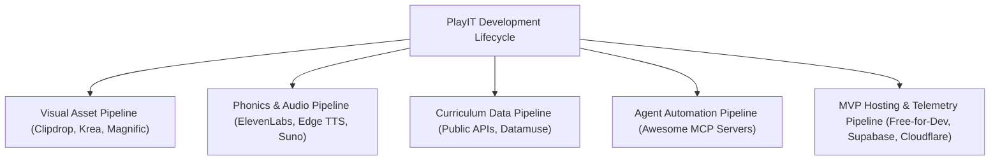

# PlayIT Tools & External Resources Guide

This document catalogs and contextualizes the developer tools, public APIs, AI generation services, and Model Context Protocol (MCP) servers curated in the `tools/` directory. It maps each resource directly to PlayIT's early childhood phonics architecture, asset pipeline, audio synthesis, and Capstone MVP validation requirements.

---

## 1. Directory Overview (`tools/`)

The `tools/` folder contains visual references and catalogs for four primary developer ecosystems:

```
tools/
├── api layer.png        # Public APIs Directory (GitHub: public-apis/public-apis, 456K stars)
├── free-for-dev.png     # Free for Developers Catalog (GitHub: ripienaar/free-for-dev, 132K stars)
├── mcp servers.png      # Awesome MCP Servers (GitHub: punkpeye/awesome-mcp-servers, 92K stars)
├── tool 1.png           # AI Media, Audio, Image & Animation Generation Suite
├── README.md            # This guide
└── dictionary_validator.py # Local utility utilizing Free Public Phonics & Dictionary APIs
```

---

## 2. Resource Categorization & PlayIT Integration

### 🛠️ Category A: AI Media, Image & Visual Processing Suite (`tool 1.png`)

| Tool / Service | Official Link | Description & Capabilities | PlayIT Use Case & Integration |
|---|---|---|---|
| **Raphael AI** | [raphael.ai](https://raphael.ai) | Uncapped AI image generation engine with stylistic flexibility. | Generating draft concept illustrations for target phoneme cards and reward badges. |
| **Krea AI** | [krea.ai](https://krea.ai) | Real-time drawing-to-image canvas and visual generation. | Interactive sketching and vector alignment for Bohol adventure map props (Chocolate Hills, Loboc River). |
| **Magnific AI** | [magnific.ai](https://magnific.ai) | High-fidelity image upscaler and semantic enhancer. | Enhancing resolution of mascot artwork and background biomes without losing crisp `#2D373E` outlines. |
| **Clipdrop** | [clipdrop.co](https://clipdrop.co) | AI background removal, object cleanup, and relighting. | Pre-processing mascot poses and word illustration cutouts for 100% transparent Android WebP rendering. |
| **ElevenLabs** | [elevenlabs.io](https://elevenlabs.io) | Voice generation and pediatric emotional tuning. | Voice modeling for Lily the Tarsier and custom phoneme pronunciations (paired with local Edge TTS). |
| **Suno** | [suno.com](https://suno.com) | AI-powered music, nursery rhyme, and melody generation. | Creating cheerful, loopable background theme music and milestone completion fanfare jingles. |
| **Runway ML** | [runwayml.com](https://runwayml.com) | Gen-2/Gen-3 text-to-video & image-to-video animator. | Animating Lily mascot celebratory reactions for milestone achievement cutscenes. |
| **Kling AI** | [klingai.kuaishou.com](https://klingai.kuaishou.com) | Physics-consistent AI video and motion generation. | Creating dynamic animated background elements (meandering river ripples, swaying palm leaves). |
| **D-ID** | [d-id.com](https://d-id.com) | Talking avatars and real-time lip-synced character animation. | Prototyping live phonics tutorial videos for parent onboarding and teacher instructions. |
| **SadTalker** | [sadtalker.ai](https://sadtalker.ai) | Single-image talking head animation driven by audio. | Generating lightweight mascot speech animations directly driven by `vo_*.mp3` voice lines. |

---

### 🌐 Category B: Public APIs for Education & Language (`api layer.png`)
* **Reference Repository**: [github.com/public-apis/public-apis](https://github.com/public-apis/public-apis) (456K+ ⭐)

| API Name | Endpoint / Resource | Value for PlayIT |
|---|---|---|
| **Free Dictionary API** | `https://api.dictionaryapi.dev/api/v2/entries/en/{word}` | Automated verification of definition, parts of speech, and IPA phonetic transcriptions. |
| **Datamuse API** | `https://api.datamuse.com/words?sp={pattern}` | Programmatic discovery of 3-to-4 letter CVC words matching available Marungko letter sets. |
| **WordsAPI** | `https://wordsapiv1.p.mashape.com/words/` | Word difficulty scoring, syllable counts, and semantic category tagging. |
| **OpenWeatherMap / Astronomy API** | Public weather & time APIs | Optional dynamic daytime/sunset map theming matching the child's local environment. |

---

### 🤖 Category C: Model Context Protocol (MCP) Servers (`mcp servers.png`)
* **Reference Repository**: [github.com/punkpeye/awesome-mcp-servers](https://github.com/punkpeye/awesome-mcp-servers) (92K+ ⭐)

| MCP Server | Protocol Role | PlayIT Workflow Advantage |
|---|---|---|
| **Pollinations MCP** | Autonomous Image & Audio API | On-demand generation of UI raster assets, blend words, and sound effects during agent coding sessions. |
| **Context7 MCP** | Deep Documentation Fetching | Real-time querying of official Jetpack Compose, Room, Kotlin Coroutines, and Vosk SDK documentation. |
| **Hugging Face MCP** | Open-source Model Hub | Integrating small speech models, phonetic classification datasets, and offline G2P (grapheme-to-phoneme) models. |
| **Chrome DevTools MCP** | Browser Automation & Testing | Automated UI auditing and screenshot verification for web-based parent dashboards and prototypes. |
| **Sequential Thinking MCP** | Multi-step Reasoning Architecture | Complex state machine verification (ASR scoring, group unlock sequencing, streak resilience). |

---

### ☁️ Category D: Free-for-Dev Infrastructure & Hosting (`free-for-dev.png`)
* **Reference Repository**: [github.com/ripienaar/free-for-dev](https://github.com/ripienaar/free-for-dev) (132K+ ⭐)

| Service | Permanent Free Tier Tier | PlayIT Deployment Application |
|---|---|---|
| **Supabase** | 500MB DB, Auth, Realtime, Edge Functions | Public research telemetry database for Week 1–2 MVP validation data collection (N=25–30 stakeholders). |
| **GitHub Actions** | 2,000 min/mo CI/CD | Automated Gradle build, unit testing, APK assembly, and release asset tagging on `git push main`. |
| **Cloudflare Pages / R2** | 10GB object storage, zero egress | High-speed global hosting for APK downloads, research framework PDF downloads, and asset backups. |
| **Vercel / Render** | Free web hosting & serverless | Hosting the interactive Parent/Teacher Web Companion Dashboard for longitudinal progress tracking. |

---

## 3. PlayIT Utility: Automated Dictionary & Word Bank Validator

To directly utilize the Public APIs referenced in `api layer.png`, we have included a production Python utility: [`tools/dictionary_validator.py`](./dictionary_validator.py).

### Usage:
```bash
# Validate any phonics word bank against the Free Dictionary and Datamuse APIs
python tools/dictionary_validator.py --group 1
```

### What it does:
1. Queries the **Datamuse API** to find all valid, age-appropriate English words formable using only the unlocked letter set.
2. Cross-references the **Free Dictionary API** to verify pronunciation, phonetic spelling, and definition simplicity.
3. Automatically confirms if a word conforms to the **Zero-Emoji Policy** and fits pediatric reading standards.

---

## 4. Summary Matrix for Developers & Researchers


